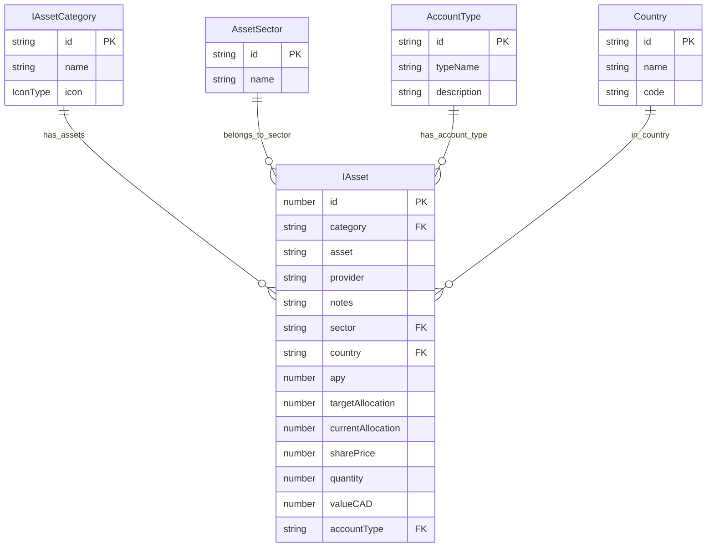

# Database Schema

```mermaid

erDiagram
    IAssetCategory {
        string id PK
        string name
        IconType icon
    }

    IAsset {
        number id PK
        string category FK
        string asset
        string provider
        string notes
        string sector FK
        string country FK
        number apy
        number targetAllocation
        number currentAllocation
        number sharePrice
        number quantity
        number valueCAD
        string accountType FK
    }

     AssetSector {
        string id PK
        string name
    }

  %% RRSP, TFSA, 401k, etc
    AccountType {
        string id PK
        string typeName
        string description
    }

    Country {
        string id PK
        string name
        string code
    }

    %% Define Relationships
    IAssetCategory ||--o{ IAsset : has_assets
    AssetSector ||--o{ IAsset : belongs_to_sector
    AccountType ||--o{ IAsset : has_account_type
    Country ||--o{ IAsset : in_country

```
